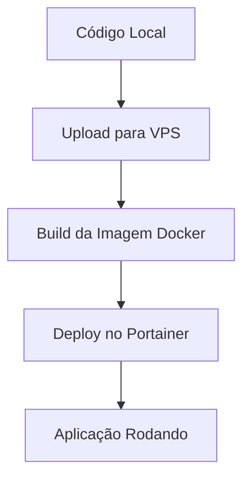

# 🚀 Guia Completo: Deploy para VPS com Portainer

## 🖥️ Informações do Servidor

**VPS Configurado:**

- **Host:** 207.180.254.250
- **Usuário:** root
- **Comando SSH:** `ssh root@207.180.254.250`
- **Caminho do projeto:** `/root/ticket-system`

**Portainer:**

- **URL:** https://portainer.iaprojetos.com.br
- **Usuário:** iaprojetos
- **Senha:** Admjuliano1@
- **Endpoint ID:** 1
- **Swarm ID:** eg6ahp92i130xiavjv7unmrjg
- **Rede:** iaprojetos

## ❓ Por que preciso enviar para a VPS?

**Resposta:** Sim, você está absolutamente correto! É necessário enviar os arquivos para a VPS antes do deploy no Portainer porque:

1. **Portainer está na VPS** - Ele precisa acessar os arquivos localmente
2. **Imagem Docker** - O `docker-compose.portainer.yml` referencia `ticket-system:latest` que precisa ser buildada na VPS
3. **Contexto de Build** - O Docker precisa do código fonte para criar a imagem

## 🔄 Processo Completo de Deploy



## 🛠️ Métodos de Deploy

### Método 1: Script Automático (Recomendado)

#### Windows (PowerShell)

```powershell
# Dar permissão de execução
Set-ExecutionPolicy -ExecutionPolicy RemoteSigned -Scope CurrentUser

# Deploy rápido (configurações pré-definidas)
.\deploy-rapido.ps1

# Deploy completo com configurações específicas
.\deploy-to-vps.ps1

# Pular upload (se já foi feito)
.\deploy-rapido.ps1 -SkipUpload -Force

# Apenas deploy (sem upload nem build)
.\deploy-rapido.ps1 -SkipUpload -SkipBuild -Force
```

#### Linux/Mac (Bash)

```bash
# Dar permissão de execução
chmod +x deploy-to-vps.sh

# Deploy completo (configurações pré-definidas)
./deploy-to-vps.sh

# Pular upload (se já foi feito)
./deploy-to-vps.sh --skip-upload --force

# Apenas deploy (sem upload nem build)
./deploy-to-vps.sh --skip-upload --skip-build --force
```

### Método 2: Manual

#### 1. Upload dos Arquivos

```bash
# Via rsync (Linux/Mac/WSL)
rsync -avz --delete \
  --exclude 'node_modules' \
  --exclude '.git' \
  --exclude '.next' \
  ./ root@207.180.254.250:/root/ticket-system/

# Via scp (alternativa)
scp -r . root@207.180.254.250:/root/ticket-system/
```

#### 2. Conectar na VPS

```bash
ssh root@207.180.254.250
cd /root/ticket-system
```

#### 3. Build da Imagem

```bash
# Verificar se Docker está instalado
docker --version

# Build da imagem
docker build -t ticket-system:latest .

# Verificar se a imagem foi criada
docker images | grep ticket-system
```

#### 4. Deploy no Portainer

```bash
# Via script PowerShell (se disponível)
pwsh -File deploy-portainer.ps1 deploy -Force

# Via API diretamente
curl -X POST "https://portainer.iaprojetos.com.br/api/stacks" \
  -H "Authorization: Bearer SEU_TOKEN" \
  -H "Content-Type: application/json" \
  -d @portainer-deploy.json
```

## 📁 Arquivos Necessários na VPS

### Estrutura Mínima

```
/root/ticket-system/
├── app/                          # Código da aplicação
├── components/                   # Componentes React
├── lib/                         # Bibliotecas
├── prisma/                      # Schema do banco
├── public/                      # Arquivos estáticos
├── styles/                      # CSS/Tailwind
├── types/                       # TypeScript types
├── docker-compose.portainer.yml # Configuração do Portainer
├── .env.portainer              # Variáveis de ambiente
├── Dockerfile                  # Build da imagem
├── package.json               # Dependências
├── next.config.js             # Configuração Next.js
└── deploy-portainer.ps1       # Script de deploy
```

### Arquivos Críticos

- **docker-compose.portainer.yml** - Configuração dos serviços
- **.env.portainer** - Variáveis de ambiente
- **Dockerfile** - Instruções de build
- **deploy-portainer.ps1** - Script de deploy

## 🔧 Configuração da VPS

### Pré-requisitos

```bash
# Atualizar sistema
sudo apt update && sudo apt upgrade -y

# Instalar Docker
curl -fsSL https://get.docker.com -o get-docker.sh
sudo sh get-docker.sh
sudo usermod -aG docker $USER

# Instalar PowerShell (para scripts)
wget -q https://packages.microsoft.com/config/ubuntu/20.04/packages-microsoft-prod.deb
sudo dpkg -i packages-microsoft-prod.deb
sudo apt update
sudo apt install -y powershell

# Reiniciar sessão
newgrp docker
```

### Configurar SSH (Opcional)

```bash
# Gerar chave SSH (local)
ssh-keygen -t rsa -b 4096 -C "seu-email@exemplo.com"

# Copiar chave pública para VPS
ssh-copy-id usuario@servidor.com

# Testar conexão
ssh usuario@servidor.com
```

## 🚨 Troubleshooting

### Problema: "Imagem não encontrada"

```bash
# Verificar se a imagem foi criada
docker images | grep ticket-system

# Se não existir, fazer build
docker build -t ticket-system:latest .
```

### Problema: "Erro de autenticação no Portainer"

```bash
# Verificar token no .env.portainer
cat .env.portainer | grep PORTAINER_TOKEN

# Atualizar token se necessário
# Obter novo token no painel do Portainer
```

### Problema: "Falha no upload"

```bash
# Verificar conectividade SSH
ssh root@207.180.254.250 "echo 'Conexão OK'"

# Verificar permissões
ssh root@207.180.254.250 "ls -la /root/"

# Criar diretório se necessário
ssh root@207.180.254.250 "mkdir -p /root/ticket-system"
```

### Problema: "Container não inicia"

```bash
# Verificar logs
docker logs ticket-system_ticket-system-multidominio

# Verificar recursos
docker stats

# Verificar rede
docker network ls | grep iaprojetos
```

## 📊 Verificações Pós-Deploy

### 1. Status dos Containers

```bash
# Via Docker
docker ps | grep ticket

# Via Portainer
# Acesse: https://portainer.iaprojetos.com.br
# Vá em: Containers → Verificar status
```

### 2. Logs da Aplicação

```bash
# Logs em tempo real
docker logs -f ticket-system_ticket-system-multidominio

# Últimas 50 linhas
docker logs --tail 50 ticket-system_ticket-system-multidominio
```

### 3. Testes de Conectividade

```bash
# Testar aplicação
curl -I https://iadm.iaprojetos.com.br

# Testar API
curl https://iadm.iaprojetos.com.br/api/health

# Testar Portainer
curl -I https://portainer.iaprojetos.com.br
```

## 🔄 Atualizações Futuras

### Deploy Rápido (após primeira configuração)

```bash
# Deploy completo
./deploy-rapido.ps1

# Apenas build + deploy (sem upload)
./deploy-rapido.ps1 -SkipUpload -Force

# Apenas deploy (sem upload nem build)
./deploy-rapido.ps1 -SkipUpload -SkipBuild -Force
```

### Via CI/CD (GitHub Actions)

```yaml
name: Deploy to VPS
on:
  push:
    branches: [main]

jobs:
  deploy:
    runs-on: ubuntu-latest
    steps:
      - uses: actions/checkout@v2

      - name: Deploy to VPS
        run: |
          ./deploy-to-vps.sh \
            -h "${{ secrets.VPS_HOST }}" \
            -u "${{ secrets.VPS_USER }}" \
            -k "${{ secrets.SSH_KEY }}" \
            --force
```

## 📞 Suporte

### Comandos Úteis

```bash
# Status geral
docker ps
docker service ls

# Logs específicos
docker logs ticket-system_postgres
docker logs ticket-system_redis

# Restart serviços
docker restart ticket-system_ticket-system-multidominio

# Limpar sistema
docker system prune -f
```

### Links Importantes

- **Aplicação:** https://iadm.iaprojetos.com.br
- **Portainer:** https://portainer.iaprojetos.com.br
- **Traefik:** https://traefik.iaprojetos.com.br

---

## ✅ Resumo

1. **SIM**, é necessário enviar arquivos para a VPS
2. **Use os scripts** `deploy-to-vps.ps1` ou `deploy-to-vps.sh`
3. **Processo:** Upload → Build → Deploy
4. **Portainer** gerencia os containers após o deploy
5. **Monitoramento** via logs e interfaces web

**🎯 Próximo passo:** Execute o script de deploy e monitore os logs!
